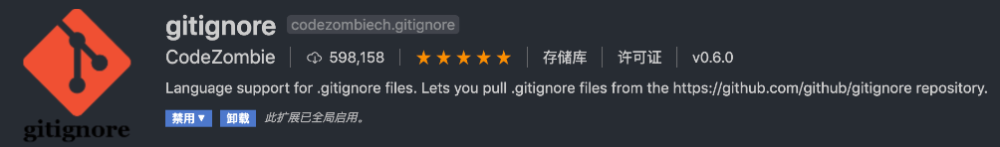
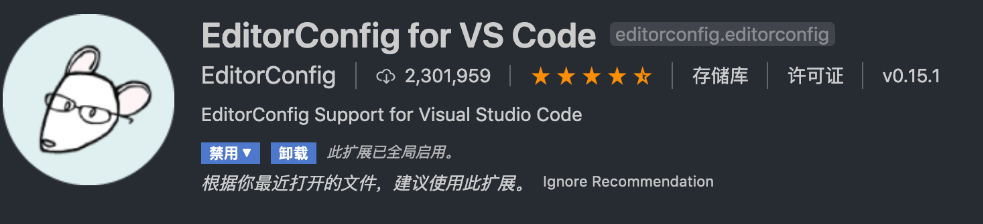
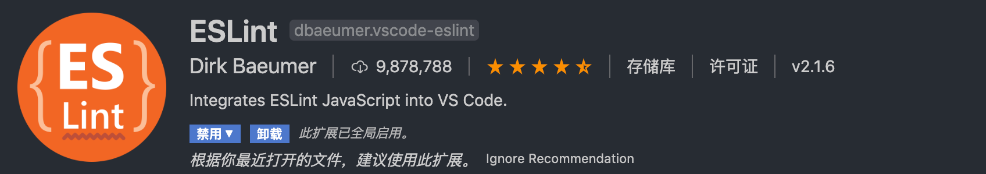
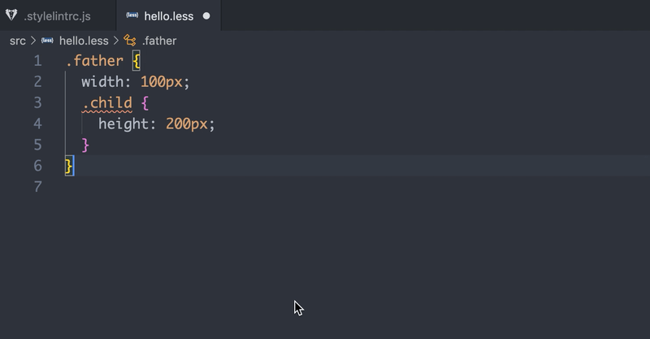
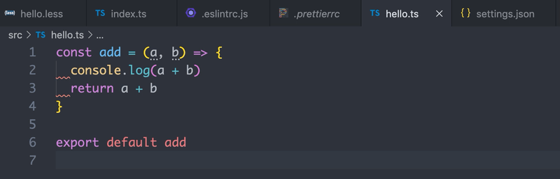
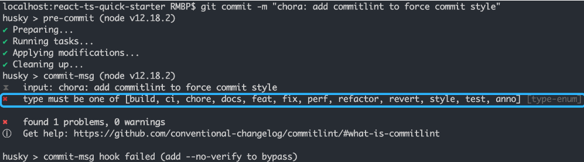

# lint+ts 模板项目

本项目使用的是`node18.18.0`，文章参考，大部分文案复制从[我是这样搭建Typescript+React项目环境的](https://github.com/vortesnail/blog/issues/14)，仅作为本人学习记录，更改其中存在问题的地方，使用的都是较新版本的包，配置会有一些不同

**问题记录**

stylelint 配置顺序修正容易抽风，重启vscode
https://juejin.cn/post/6940127032932040735#heading-1

lint-stage配置在commit的时候进行类型检测
https://juejin.cn/post/7257441221761040444?searchId=202403162308273C8699A823B5DCC6A0A0#heading-9

husky生成.husky文件夹，在其中执行脚本，比如pre-commit，文件中写入对应需要执行的脚本

# 一、项目初始化及配置

## 1.package.json

每一个项目都需要一个 `package.json` 文件，它的作用是记录项目的配置信息，比如我们的项目名称、包的入口文件、项目版本等，也会记录所需的各种依赖，还有很重要的 `script` 字段，它指定了运行脚本命令的 `npm` 命令行缩写。

通过以下命令就能快速生成该文件：

```
npm init -y | yarn init -y
```

通过修改生成的默认配置，现在的内容如下：

```json
{
  "name": "ts-lint-quick-starter",
  "version": "1.0.0",
  "description": "",
  "main": "index.js",
  "scripts": {},
  "repository": {
    "type": "git",
    "url": ""
  },
  "keywords": [],
  "author": {
    "name": "zhu ling",
    "url": "",
    "email": ""
  },
  "license": "MIT",
  "bugs": {
    "url": ""
  },
  "homepage": ""
}
```

- `description` ：增加了对该项目的描述，github 进行 repo 搜索时，关键字匹配会使你的项目更容易被搜索到。
- `scripts` ：把默认生成的删了，没啥用。
- `keywords` ：增加了项目关键字，其他开发者在 npm 上搜索的时候，适合的关键字能你的包更容易被搜索到。
- `author` ：添加了更具体的作者信息。
- `license` ：修改为[MIT](https://opensource.org/licenses/MIT)协议。

## 2.LICENSE

我们在建仓库的时候会有选项让我们选择开源协议，我当时就选了MIT协议，如果没选的也不要紧，去网站 [choosealicense](http://choosealicense.online/) 选择合适的 license（一般会选宽松的 MIT 协议），复制到项目根目录下的 `LICENSE` 文件内即可，然后修改作者名和年份，如下：

```
MIT License

Copyright (c) 2024 zhu ling

Permission is hereby granted, free of charge, to any person obtaining a copy
of this software and associated documentation files (the "Software"), to deal
in the Software without restriction, including without limitation the rights...
```

## 3.gitignore

该文件决定了项目进行 git 提交时所需要忽略掉的文件或文件夹，编辑器如 vscode 也会监听 `.gitignore` 之外的所有文件，如果没有进行忽略的文件有所变动时，在进行 git 提交时就会被识别为需要提交的文件。

`node_modules` 是我们安装第三方依赖的文件夹，这个肯定要添加至 `.gitignore` 中，且不说这个文件夹里面成千上万的文件会给编辑器带来性能压力，也会给提交至远端的服务器造成不小损失，另外就是这个文件夹中的东西，完全可以通过简单的 `npm install` 就能得到～

所以不需要上传至 git 仓库的都要添加进来，比如我们常见的 `build` 、 `dist` 等，还有操作系统默认生成的，比如 MacOs 会生成存储项目文件夹显示属性的 `DS_Store` 文件。

可以用插件生成



## 4.npmrc | yarnrc

大家一开始使用 npm 安装依赖包时，肯定感受过那挤牙膏般的下载速度，上网一查只需要将 npm 源设置为淘宝镜像源就行，在控制台执行一下以下命令：

现在淘宝证书到期了，换了，

```
npm config set registry https://registry.npmmirror.com
```

从此过上了**速度七十迈，心情是自由自在**的生活。

但是大家想想，万一某个同学克隆了你的项目之后，准备在他本地开发的时候，并没有设置淘宝镜像源，又要人家去手动设置一遍，我们作为项目的发起者，就先给别人省下这份时间吧，只需要在根目录添加一个 `.npmrc` 并做简单的配置即可：

```
# 创建 .npmrc 文件
touch .npmrc
# 在该文件内输入配置
registry=https://registry.npmmirror.com/
```

```
# 创建 .yarnrc 文件
touch .yarnrc
# 在该文件内输入配置
registry "https://registry.npmmirror.com"
```

## 5.README.md

你只要上 github 找任何一个项目，点进去之后往下拉一点，看到的对项目的直接说明就是 `README.md` 所呈现的，这个文件无比重要，一个好的开源项目必须！必须！必须！有一个简明且美观的 `README.md` ，不过文章写到现在为止，我们的这个脚手架并没有任何实质性的内容，之后完全配置完之后，会再好好书写一下。

后续我还会再对这部分内容做补充，现在大家先 `touch README.md` 创建文件，然后随意写点东西先看着～

# 二、规范代码与提交

## 1.解决代码风格问题

### 1.1.EditorConfig编辑器风格

`.editorconfig` 是跨编辑器维护一致编码风格的配置文件，有的编辑器会默认集成读取该配置文件的功能，但是 vscode 需要安装相应的扩展 [EditorConfig For vs Code](https://marketplace.visualstudio.com/items?itemName=EditorConfig.EditorConfig) 。



安装完此扩展后，在 vscode 中使用快捷键 `ctrl+shift+p` 打开命令台，输入 `Generate .editorcofig` 即可快速生成 `.editorconfig` 文件，当然，有时候 vscode 抽风找不到命令也是可能的，比如我就经常遇到输入该命令没用，需要重启才会重新出现，那么就手动创建该文件也是没问题的。

该文件的配置特别简单，就少许的几个配置，比如我的配置如下

```
root = true

[*]
indent_style = space
indent_size = 2
charset = utf-8
trim_trailing_whitespace = true
insert_final_newline = true
end_of_line = lf

[*.md]
trim_trailing_whitespace = false
```

扩展装完，配置配完，编辑器就会去首先读取这个配置文件，对缩进风格、缩进大小在换行时直接按照配置的来，在你 `ctrl+s` 保存时，就会按照里面的规则进行代码格式化。以下是上述配置的简单介绍：

- `indent_style` ：缩进风格，可选配置有 `tab` 和 `space` 。
- `indent_size` ：缩进大小，可设定为 `1-8` 的数字，比如设定为 `2` ，那就是缩进 `2` 个空格。
- `charset` ：编码格式，通常都是选 `utf-8` 。
- `trim_trailing_whitespace` ：去除多余的空格，比如你不小心在尾巴多打了个空格，它会给你自动去掉。
- `insert_final_newline` ：在尾部插入一行，个人很喜欢这个风格，当最后一行代码很长的时候，你又想对该行代码比较靠后的位置编辑时，不要太好用哦，建议大家也开上。
- `end_of_line` ：换行符，可选配置有 `lf` ，`cr` ，`crlf` ，会有三种的原因是因为各个操作系统之间的换行符不一致，这里有历史原因，有兴趣的同学自行了解吧，许多有名的开源库都是使用 `lf` ，我们姑且也跟跟风吧。

因为 `markdown` 语法中，我想要换行需要在上一行多打 2 个以上的空格，为了不影响该语法，故 `.md` 文件中把**去除多余空格**关掉了。

### 1.2.Prettier

#### 1.2.1 安装配置

如果说 `EditorConfig` 帮你统一编辑器风格，那 `Prettier` 就是帮你统一项目风格的。 `Prettier` 拥有更多配置项（实际上也不多，数了下二十个），且能在发布流程中执行命令自动格式化，能够有效的使项目代码风格趋于统一。

在我们的项目中执行以下命令安装我们的第一个依赖包：

```
yarn add prettier@3.2.5 -D
```

安装成功之后在根目录新建文件 `.prettierrc` ，输入以下配置：

```json
{
  "trailingComma": "all",
  "tabWidth": 2,
  "semi": false,
  "singleQuote": true,
  "endOfLine": "lf",
  "printWidth": 120,
  "bracketSpacing": true,
  "arrowParens": "always"
}
```

其实 `Prettier` 的配置项很少，大家可以去 [Prettier Playground](https://prettier.io/playground/) 大概把玩一会儿，下面我简单介绍下上述的配置：

- `trailingComma` ：对象的最后一个属性末尾也会添加 `,` ，比如 `{ a: 1, b: 2 }` 会格式为 `{ a: 1, b: 2, }` 。
- `tabWidth` ：缩进大小。
- `semi` ：分号是否添加，我以前从C++转前端的，有一段时间非常不能忍受不加分号的行为，现在香的一匹。
- `singleQuote` ：是否单引号，绝壁选择单引号啊，不会真有人还用双引号吧？不会吧！😏
- `jsxSingleQuote` ：jsx 语法下是否单引号，同上。
- `endOfLine` ：与 `.editorconfig` 保持一致设置。
- `printWidth` ：单行代码最长字符长度，超过之后会自动格式化换行。
- `bracketSpacing` ：在对象中的括号之间打印空格， `{a: 5}` 格式化为 `{ a: 5 }` 。
- `arrowParens` ：箭头函数的参数无论有几个，都要括号包裹。比如 `(a) => {}` ，如果设为 `avoid` ，会自动格式化为 `a => {}` 。

#### 1.2.2 配置保存自动格式化

你所需要做的是先安装扩展 [Prettier - Code formatter](https://marketplace.visualstudio.com/items?itemName=esbenp.prettier-vscode) ：


当安装结束后， 在项目根目录新建一个文件夹 `.vscode` ，在此文件下再建一个 `settings.json` 文件：


该文件的配置优先于 vscode 全局的 `settings.json` ，这样别人下载了你的项目进行开发，也不会因为全局 `setting.json` 的配置不同而导致 `Prettier` 或之后会说到的 `ESLint` 、 `StyleLint` 失效，接下来在该文件内输入以下代码：

```json
{
  // 指定哪些文件不参与搜索
  "search.exclude": {
    "**/node_modules": true,
    "dist": true,
    "yarn.lock": true
  },
  "editor.formatOnSave": true,
  "[javascript]": {
    "editor.defaultFormatter": "esbenp.prettier-vscode"
  },
  "[javascriptreact]": {
    "editor.defaultFormatter": "esbenp.prettier-vscode"
  },
  "[typescript]": {
    "editor.defaultFormatter": "esbenp.prettier-vscode"
  },
  "[typescriptreact]": {
    "editor.defaultFormatter": "esbenp.prettier-vscode"
  },
  "[json]": {
    "editor.defaultFormatter": "esbenp.prettier-vscode"
  },
  "[html]": {
    "editor.defaultFormatter": "esbenp.prettier-vscode"
  },
  "[markdown]": {
    "editor.defaultFormatter": "esbenp.prettier-vscode"
  },
  "[css]": {
    "editor.defaultFormatter": "esbenp.prettier-vscode"
  },
  "[less]": {
    "editor.defaultFormatter": "esbenp.prettier-vscode"
  },
  "[scss]": {
    "editor.defaultFormatter": "esbenp.prettier-vscode"
  }
}
```

`"editor.formatOnSave"` 的作用是在我们保存时，会自动执行一次代码格式化，而我们该使用什么格式化器？接下来的代码便是设置默认的格式化器，看名字大家也能看得出来了吧！

在遇到 `.js` 、 `.jsx` 、`.ts` 、`.tsx` 、`.json` 、`.html` 、`.md` 、 `.css` 、 `.less` 、 `.scss` 为后缀的文件时，都会去使用 `Prettier` 去格式化代码，而格式化的规则就是我们配置的 `.prettierrc` 决定的！

.gif)

`.editorconfig` 配置文件中某些配置项是会和 `Prettier` 重合的，例如 指定缩进大小 两者都可以配置。

#### 1.2.3 与EditorConfig的区别

我们可以看到 `EditorConfig` 的配置项都是一些**不涉及具体语法**的，比如 缩进大小、文移除多余空格等。

而 `Prettier` 是一个格式化工具，要根据**具体语法格式化**，对于不同的语法用单引号还是双引号，加不加分号，哪里换行等，当然，肯定也有缩进大小。

即使缩进大小这些共同都有的设置，两者也是不冲突的，设置 `EditorConfig` 的 `indent_size` 为 `4` ， `Prettier` 的 `tabWidth` 为 `2` 。

.gif)

可以看到，在我们新起一行时，根据 `.editorconfig` 中的配置，缩进大小为 `4` ，所以光标直接跳到了此处，但是保存时，因为我们默认的格式化工具已经在 `.vscode/settings.json` 中设置为了 `Prettier` ，所以这时候读取缩进大小为 `2` 的配置，并正确格式化了代码。

当然，我还是建议大家两个都配置文件重合的地方都保持一致比较好～

### 1.2.4 .prettierignore

忽略格式化的文件

## 2.代码质量问题

### 2.1 ESLint

#### 2.1.1 安装配置

在上面我们配置了 `EditorConfig` 和 `Prettier` 都是为了解决**代码风格问题**，而 `ESLint` 是主要为了解决**代码质量问题**，它能在我们编写代码时就检测出程序可能出现的隐性BUG，通过 `eslint --fix` 还能自动修复一些代码写法问题，比如你定义了 `var a = 3` ，自动修复后为 `const a = 3` 。还有许多类似的强制扭转代码最佳写法的规则，在无法自动修复时，会给出红线提示，强迫开发人员为其寻求更好的解决方案。

> prettier 代码风格统一支持的语言更多，而且差异化小，eslint 一大堆的配置能弄出一堆风格，prettier 能对 ts js html css json md做风格统一，这方面 eslint 比不过。 --来自“三元小迷妹”

我们先把它用起来，直观感受一下其带来的好处！

首先在项目中安装 `eslint` ：

```
yarn add eslint@8.0.1 -D
```

#### 2.1.1 初始化配置文件

```
npx eslint --init
```

上述命令的功能为初始化 `ESLint` 的配置文件，采取的是问答的形式，特别人性化。不过在我们介绍各个问答之前先来看看这句命令中 `npx` 是什么。

安装结束后，项目根目录下多出了新的文件 `.eslintrc.js` ，这便是我们的 `eslint` 配置文件了。更改后的内容如下

```js
const OFF = 0;
const WARN = 1;
const ERROR = 2;

module.exports = {
  env: {
    browser: true,
    es2021: true,
    node: true,
  },
  extends: ["standard-with-typescript", "plugin:react/recommended", "prettier"],
  overrides: [
    {
      env: {
        node: true,
      },
      files: [".eslintrc.{js,cjs}"],
      parserOptions: {
        sourceType: "script",
      },
    },
  ],
  parserOptions: {
    ecmaVersion: "latest",
    sourceType: "module",
    ecmaFeatures: {
      jsx: true,
    },
  },
  plugins: ["react"],
  rules: {
    // 对象的最后一个可以增加【,】
    "@typescript-eslint/comma-dangle": OFF,
    // 单引号关闭
    "@typescript-eslint/quotes": OFF,
    // 需要分号
    "@typescript-eslint/semi": OFF,
    // 不允许使用var
    "no-var": ERROR,
    // 函数不需要ts标注返回类型
    "@typescript-eslint/explicit-function-return-type": OFF,
  },
};
```

各个属性字段的作用可在 [Configuring ESLint](https://eslint.bootcss.com/docs/user-guide/configuring) 仔细了解，可能会比较迷惑的地方是 `extends` 和 `plugins` 的关系，其实 `plugins` 就是**插件**的意思，都是需要 npm 包的安装才可以使用，只不过默认支持简写，官网都有说；至于 `extneds` 其实就是使用我们已经下载的插件的某些预设规则。

#### 2.1.3 配置自动修复

我们知道 `eslint` 由编辑器支持是有自动修复功能的，首先我们需要安装扩展：



再到之前创建的 `.vscode/settings.json` 中添加以下代码：

```json
{
  "eslint.validate": ["javascript", "javascriptreact", "typescript", "typescriptreact"],
  "typescript.tsdk": "./node_modules/typescript/lib", // 代替 vscode 的 ts 语法智能提示
  "editor.codeActionsOnSave": {
    "source.fixAll.eslint": true
  }
}
```

这时候我们保存时，就会开启 `eslint` 的自动修复，完美！


不过有时候我们并不希望 `ESLint` 或 `Prettier` 去对某些文件做任何修改，比如某个特定的情况下我想去看看打包之后的文件内容，里面的内容一定是非常不符合各种 lint 规则的，但我不希望按保存时对其进行格式化，此时就需要我们添加 `.eslintignore` 和 `.prettierignore` ，我一般会使这两个文件的内容都保持一致：

```
/node_modules
/build
/dist
```

### 2.2 StyleLint

#### 2.2.1 安装配置

安装两个基本的包：

```
yarn add stylelint@16.2.1 stylelint-config-standard@36.0.0 -D
```

然后在项目根目录新建 `.stylelintrc.js` 文件，输入以下内容：

```
module.exports = {
  extends: ['stylelint-config-standard'],
  rules: {
    'comment-empty-line-before': null,
    'declaration-empty-line-before': null,
    'function-name-case': 'lower',
    'no-descending-specificity': null,
    'no-invalid-double-slash-comments': null,
    'rule-empty-line-before': 'always',
  },
  ignoreFiles: ['node_modules/**/*', 'build/**/*'],
}
```

同样，简单介绍下配置上的三个属性：

- `extends` ：其实和 `eslint` 的类似，都是扩展，使用 `stylelint` 已经预设好的一些规则。
- `rules` ：就是具体的规则，如果默认的你不满意，可以自己决定某个规则的具体形式。
- `ignoreFiles` ：不像 `eslint` 需要新建 ignore 文件， `stylelint` 配置就支持忽略配置字段，我们先添加 `node_modules` 和 `build` ，之后有需要大家可自行添加。

> 其中关于 `xxx/**/*` 这种写法的意思有不理解的，大家可在 `google` （或百度）**glob模式**。

#### 2.2.2 配置保存自动修复

与 `eslint` 一样，想要在编辑代码时有错误提示以及自动修复功能，我们需要 vscode 安装一个扩展：


并且在 `.vscode/settings.json` 中增加以下代码：

```js
{
	// 使用 stylelint 自身的校验即可
  "css.validate": false,
  "less.validate": false,
  "scss.validate": false,

  "editor.formatOnSave": true,
  "editor.codeActionsOnSave": {
    "source.fixAll.eslint": true,
    "source.fixAll.stylelint": true
  },
}
```

这时候随便建一个 `.less` 文件测试下，已经有错误提示和保存时自动修复功能了。



#### 2.2.3 配置顺序自动修复

安装[stylelint-order](https://www.npmjs.com/package/stylelint-order)这个插件就可以了， 具体配置项的话看npm上的配置就行了，配置这个的时候vscode可能会抽疯，配置正确但是没效果，重启vscode就行了

```
yarn add stylelint-order@6.0.4 -D
```

#### 2.2.4 根据分组排序

配置[stylelint-config-rational-order](https://github.com/constverum/stylelint-config-rational-order)插件

```
yarn add stylelint-config-rational-order@0.1.2 -D
```

会按照如下属性进行分组排序

```
1.Positioning   2.Box Model    3.Typography    4.Visual    5.Animation    6.Misc
```


#### 2.2.5 提示我们写的矛盾样式

[stylelint-declaration-block-no-ignored-properties](https://github.com/kristerkari/stylelint-declaration-block-no-ignored-properties) 用于提示我们写的矛盾样式，比如下面的代码中 `width` 是会被浏览器忽略的，这可以避免我们犯一些低级错误～

```
yarn add stylelint-declaration-block-no-ignored-properties@2.8.0 -D
```

lint文件中配置

```json
// .stylelintrc
{
  "plugins": ["stylelint-declaration-block-no-ignored-properties"],
  "rules": {
    "plugin/declaration-block-no-ignored-properties": true
  }
}
```

### 2.3 ESLint、Stylelint 和 Prettier 的冲突

有时候 `eslint` 和 `stylelint` 的自定义规则和 `prettier` 定义的规则冲突了，比如在 `.eslintrc.js` 中某个 `extends` 的配置设置了缩进大小为 `4` ，但是我 `.prettierrc` 中我设置的缩进为 `2` ，那就会出现我们保存时，先是 `eslint` 的自动修复缩进大小为 `4` ，这个时候 `prettier` 不开心了，又强制把缩进改为了 `2` ，好了， `eslint` 不开心，代码直接爆红！



那么我们如何解决这部分冲突呢？

##### eslint冲突

其实官方提供了很好的解决方案，查阅 [Integrating with Linters](https://prettier.io/docs/en/integrating-with-linters.html) 可知，针对 `eslint` 和 `stylelint` 都有很好的插件支持，其原理都是禁用与 `prettier` 发生冲突的规则。

安装插件 [eslint-config-prettier](https://github.com/prettier/eslint-config-prettier) ，这个插件会禁用所有和 prettier 起冲突的规则：

```
yarn add eslint-config-prettier@9.1.0 -D
```

添加以下配置到 `.eslintrc.js` 的 `extends` 中：

```json
{
  "extends": ["some-other-config-you-use", "prettier"]
}
```

这里需要注意， `'prettier'` 及之后的配置要放到原来添加的配置的后面，这样才能让 `prettier` 禁用之后与其冲突的规则。

##### stylelint冲突

`stylelint` 的冲突解决也是一样的，先安装插件 [stylelint-config-prettier](https://github.com/prettier/stylelint-config-prettier) ：

```
yarn add stylelint-config-prettier@9.0.5 -D
```

添加配置

```json
{
  "extends": [
    // other configs ...
    "stylelint-config-prettier"
  ]
}
```

### 2.4 lint-staged&husky

在项目开发过程中，每次提交前我们都要对代码进行格式化以及 `eslint` 和 `stylelint` 的规则校验，以此来强制规范我们的代码风格，以及防止隐性 BUG 的产生。

那么有什么办法只对我们 git 缓存区最新改动过的文件进行以上的格式化和 lint 规则校验呢？答案就是[ lint-staged](https://github.com/okonet/lint-staged) 。

我们还需要另一个工具 [husky](https://github.com/typicode/husky) ，它会提供一些钩子，比如执行 `git commit` 之前的钩子 `pre-commit` ，借助这个钩子我们就能执行 `lint-staged` 所提供的代码文件格式化及 lint 规则校验！

```
yarn add husky@9.0.11 lint-staged@15.2.2 -D
```

启用husky，执行如下命令会自动在package中增加命令

```
npx husky install
```

husky prepare 命令，自动加入

```
{
  "scripts": {
    "prepare": "husky install"
  }
}
```

完成husky配置之后，我们做到了通过每次git提交时都对项目做 lint 检查，防止不符合规范的代码提交到仓库，但是这带来一个问题：每次提交都将对整个项目做 lint 检查，对于一个越来越大的项目来说，这无疑是一个很耗时的操作，除此之外，对于新接入这些配置的项目，项目中可能已经存在了大量不符合规范的代码，不能要求在提交时把所有历史遗留的问题修复之后才能提交。这个时候就需要用到lint-staged这个工具了。

随后在 `package.json` 中添加以下代码（位置随意，我比较习惯放在 `repository` 上面）：

```
{
	"husky": {
    "hooks": {
      "pre-commit": "lint-staged",
    }
  },
  "lint-staged": {
    "*.{ts,tsx,js}": [
      "eslint --config .eslintrc.js"
    ],
    "*.{css,less,scss}": [
      "stylelint --config .stylelintrc.js"
    ],
    "*.{ts,tsx,js,json,html,yml,css,less,scss,md}": [
      "prettier --write"
    ]
  },
}
```

首先，我们会对暂存区后缀为 `.ts .tsx .js` 的文件进行 `eslint` 校验， `--config` 的作用是指定配置文件。之后同理对暂存区后缀为 `.css .less .scss` 的文件进行 `stylelint` 校验，注意⚠️，我们没有添加 `--fix` 来自动修复不符合规则的代码，因为自动修复的内容对我们不透明，你不知道哪些代码被更改，这对我来说是无法接受的。

但是在使用 `prettier` 进行代码格式化时，完全可以添加 `--write` 来使我们的代码自动格式化，它不会更改语法层面上的东西，所以无需担心。

修改.husky/pre-commit脚本的内容，将.husky/pre-commit脚本的内容改为npm run lint-staged， 通过上面的步骤，就完成了lint-staged的配置，这个时候再进行 git 提交时，将只检查暂存区（staged）的文件，不会检查项目所有文件，加快了每次提交 lint 检查的速度，同时也不会被历史遗留问题影响。通过这样的约束让我们定义的规则规范大家都能去遵守，共同维护代码的质量。

```
#!/usr/bin/env sh
npx lint-staged
```

> 可能大家搜索一些文章的时候，会发现在 lint-staged 中还配置了一个 git add ，实际上在 v10 版本之后任何被修改了的原 staged 区的文件都会被自动 git add，所以无需再添加。

### 2.5 lint命令

我们在 `package.json` 的 `scripts` 中增加以下三个配置：

```json
{
  "scripts": {
    "lint": "npm run lint-eslint && npm run lint-stylelint",
    "lint-eslint": "eslint -c .eslintrc.js --ext .ts,.tsx,.js src",
    "lint-stylelint": "stylelint --config .stylelintrc.js src/**/*.{less,css,scss}"
  }
}
```

在控制台执行 `npm run lint-eslint` 时，会去对 `src/` 下的指定后缀文件进行 `eslint` 规则检测， `lint-stylelint` 也是同理， `npm run lint` 会两者都按顺序执行。

其实我个人来说，这几个命令我是都不想写进 `scripts` 中的，因为我们写代码的时候，不规范的地方就已经自动修复了，只要保持良好的习惯，看到有爆红线的时候想办法去解决它，而不是视而不见，那么根本不需要对所有包含的文件再进行一次命令式的规则校验。

但是对于新提交缓存区的代码还是有必要执行一次校验的，这个后面会说到。

## 3.提交管理commitlint + changelog

> 在多人协作的项目中，如果 git 的提交说明精准，在后期协作以及 bug 处理时会变得有据可查，项目的开发可以根据规范的提交说明快速生成开发日志，从而方便开发者或用户追踪项目的开发信息和功能特性。

> 建议阅读 [Commit message 和 Change log 编写指南（阮一峰）](http://www.ruanyifeng.com/blog/2016/01/commit_message_change_log.html)

[commitlint](https://github.com/conventional-changelog/commitlint) 可以帮助我们进行 git commit 时的 message 格式是否符合规范，[conventional-changelog](https://github.com/conventional-changelog/commitlint) 可以帮助我们快速生成 `changelog` ，至于在命令行中进行可视化的 git commit 插件 [commitizen](https://github.com/commitizen/cz-cli) 我们就不配了，有兴趣的同学可以自行了解～

首先安装 `commitlint` 相关依赖：

```
yarn add @commitlint/cli@19.2.0 @commitlint/config-conventional@19.1.0 -D
```

[@commitlint/config-conventional](https://github.com/conventional-changelog/commitlint/tree/master/@commitlint/config-conventional) 类似 `eslint` 配置文件中的 `extends` ，它是官方推荐的 angular 风格的 commitlint 配置，提供了少量的 lint 规则，默认包括了以下除了我自己新增的 `type` 。

随后在根目录新建文件 `.commitlintrc.js` ，这就是我们的 commitlint 配置文件，写入以下代码：

```
module.exports = {
  extends: ['@commitlint/config-conventional'],
  rules: {
    'type-enum': [
      2,
      'always',
      ['build', 'ci', 'chore', 'docs', 'feat', 'fix', 'perf', 'refactor', 'revert', 'style', 'test', 'addlog'],
    ],
  },
}
```

我自己增加了一种 `addlog` ，目的是表示一些注释的增删改的提交。

```
/**
 * build : 改变了build工具 如 webpack
 * ci : 持续集成新增
 * chore : 构建过程或辅助工具的变动
 * feat : 新功能
 * docs : 文档改变
 * fix : 修复bug
 * perf : 性能优化
 * refactor : 某个已有功能重构
 * revert : 撤销上一次的 commit
 * style : 代码格式改变
 * test : 增加测试
 * addlog: 增加注释
 */
```

随后回到 `package.json` 的 `husky` 配置，增加一个钩子：

```
{
  "husky": {
    "hooks": {
      "pre-commit": "lint-staged",
      "commit-msg": "commitlint --config .commitlintrc.js -E HUSKY_GIT_PARAMS"
    }
  },
}
```

`-E HUSKY_GIT_PARAMS` 简单理解就是会拿到我们的 message ，然后 commitlint 再去进行 lint 校验。

接着配置生成我们的 changelog ，首先安装依赖：

```
yarn add conventional-changelog-cli@4.1.0 -D
```

在 `package.json` 的 `scripts` 下增加一个命令：

```
{
  "scripts": {
    "changelog": "conventional-changelog -p angular -i CHANGELOG.md -s"
  },
}
```

之后就可以通过 `npm run changelog` 生成 angular 风格的 changelog ，需要注意的是，上面这条命令产生的 changelog 是基于上次 tag 版本之后的变更（feat、fix 等等）所产生的。

现在就来测试一下我们上面的工作有没有正常运行吧！执行以下提交信息不规范（chore 写成 chora）的命令：

```
# 提交所有变化到缓存区
git add -A
# 把暂存区的所有修改提交到分支
git commit -m "chora: add commitlint to force commit style"
```

像预期中的一致，出现了以下报错：



那我们现在进行我们的提交，把故意写错的改回来：

```
git commit -m "chore: add commitlint to force commit style"
```

这时候我们成功 commit ，再执行以下命令提交到远端：

```
git push origin master
```
