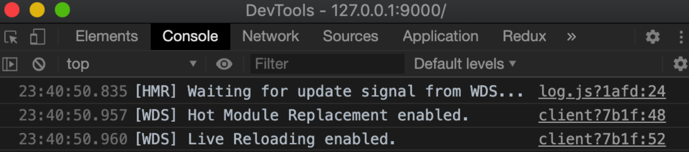
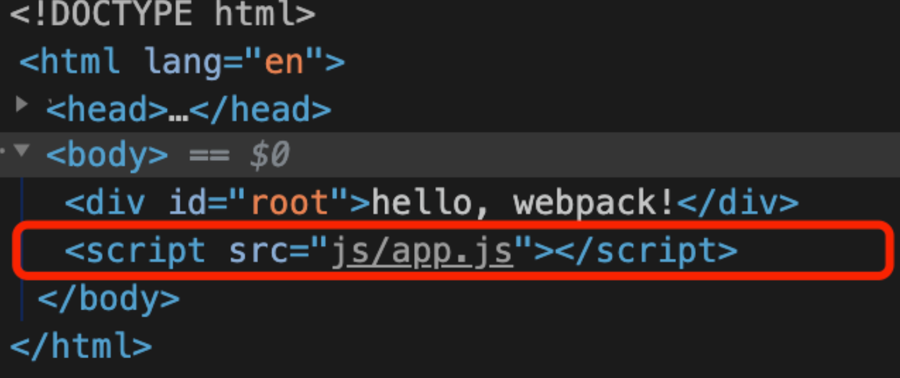
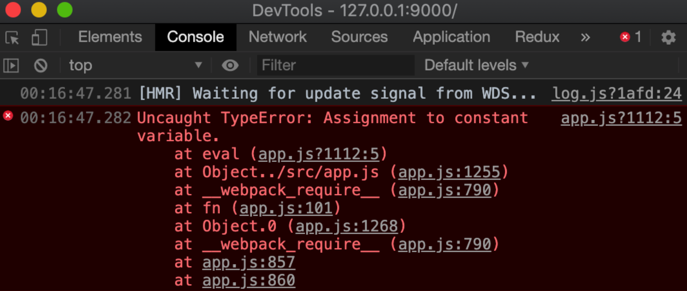
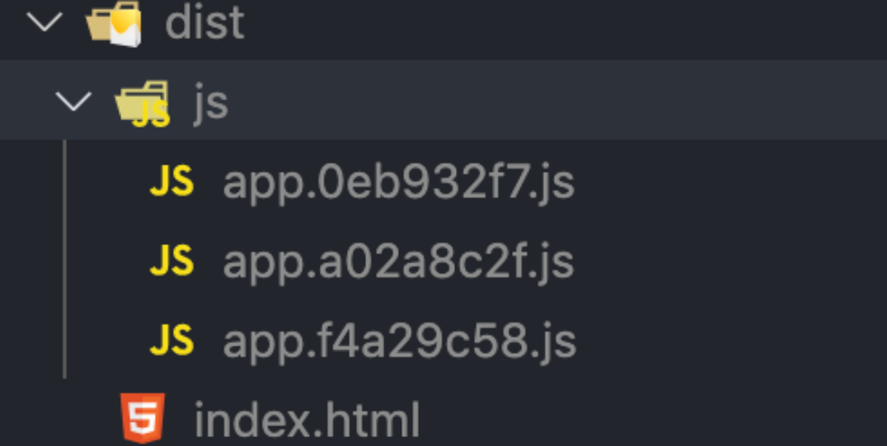

# Webpack5 基本配置

# 一、安装、配置

```
yarn add webpack@5.90.3 webpack-cli@5.1.4 -D
```

- `webpack` ：这不必多说，其用于编译 JavaScript 模块。
- `webpack-cli` ：此工具用于在命令行中运行 webpack。

紧接着我们在根目录下新建文件夹 `scripts` ，在之下再建一个文件夹 `config` ，在 `config` 中再建一个 `.js` 文件 `webpack.common.js` ，此结构如下：

```
scripts/
    config/
    webpack.common.js
```

为什么会是这样的目录结构，主要考虑到之后讲了 `webpack-merge` 之后，会把 webpack 的核心配置文件放到 `config` 下，其余的例如导出文件路径的文件模块放到 `config` 同级。总之大家先这样搞着，之后咱慢慢解释。

# 二、打包出、入口input、output

**入口(input)**和**出口(output)**是 webpack 的核心概念之二，从名字就能大概感知他们是干什么的：**指定一个（或多个）入口文件，经过一系列的操作之后转换成另一个（或多个）文件**。

接下来在 `webpack.common.js` 中输入以下代码：

```js
const path = require('path')

module.exports = {
  entry: {
    app: path.resolve(__dirname, '../../src/app.js'),
  },
  output: {
    filename: 'js/[name].[hash:8].js',
    path: path.resolve(__dirname, '../../dist'),
  },
}
```

> webpack 配置是标准的 Node.js 的 CommonJS 模块，它通过 `require` 来引入其他模块，通过 `module.exports` 导出模块，由 webpack 根据对象定义的属性进行解析。

- `entry` ：定义了入口文件路径，其属性名 `app` 表示引入文件的名字。
- `output` ：定义了编译打包之后的文件名以及所在路径。

这段代码的意思就是告诉 webpack，入口文件是根目录下的 `src` 下的 `app.js` 文件，打包输出的文件位置为根目录下的 `dist` 中，注意到 `filename` 为 `js/[name].[hash:8].js` ，那么就会在 `dist` 目录下再建一个 `js` 文件夹，其中放了命名与入口文件命名一致，并带有 hash 值的打包之后的 js 文件。

接下来在根目录创建 `src` 文件夹，新建 `app.js` 文件，输入以下代码：

```js
const root = document.querySelector('#root')
root.innerHTML = 'hello, webpack!'
```

现在我们尝试使用刚才的 webpack 配置对其进行打包，那如何操作呢？
打开 `package.json` ，为其添加一条 npm 命令：

```json
{
  "scripts": {
    "build": "webpack --config ./scripts/config/webpack.common.js",
  },
}
```

> `--config` 选项来指定配置文件

然后在控制台输入：

```
npm run build
```

等待一两秒后，你会发现根目录下真的多出了一个 `dist` 文件夹，里面的内容和我们 webpack 配置所想要达到的效果是一样的：一个 js 文件夹以及下面的（比如） `app.e406fb9b.js` 的文件。

至此，我们已经初步使用 webpack 打了一个包，接下来我们逐步开始扩展其他的配置以及相应优化吧！～

# 三、公用变量文件

在上面简单的 webpack 配置中，我们发现有两个表示路径的语句：

```
path.resolve(__dirname, '../../src/app.js')
path.resolve(__dirname, '../../dist')
```

- `path.resolve` ：node 的官方 api，可以将路径或者路径片段解析成绝对路径。
- `__dirname` ：其总是指向被执行 js 文件的绝对路径，比如在我们 webpack 文件中访问了 `__dirname` ，那么它的值就是在电脑系统上的绝对路径，比如在我电脑上就是：

```
/Users/**/**/scripts/config
```

所以我们上面的写法，大家可以简单理解为， `path.resolve` 把**根据当前文件的执行路径下**而找到的想要访问到的**文件相对路径**转换成了：**该文件在系统中的绝对路径！**

比如我的就是：

```
/Users/**/**/src/app.js
```

但是大家也看出来了，这种写法需要不断的 `../../` ，这个在文件层级较深时，很容易出错且很不优雅。那我们就换个思路，都从根目录开始找所需的文件路径不久很简单了吗，相当于省略了 `../../` 这一步。

在 `scripts` 下新建一个 `constant.js` 文件，专门用于存放我们的公用变量（之后还会有其他的）：

```
scripts/
	config/
  	webpack.common.js
+ constant.js
```

在里面定义我们的变量：

```js
const path = require('path')

const PROJECT_PATH = path.resolve(__dirname, '../')
const PROJECT_NAME = path.parse(PROJECT_PATH).name

module.exports = { 
  PROJECT_PATH,
  PROJECT_NAME
}
```

- `PROJECT_PATH` ：表示项目的根目录。
- `PROJECT_NAME` ：表示项目名，目前不用，但之后的配置会用到，我们就先定义好吧～

> 上面两个简单的 node api 大家可以自己简单了解一下，不想了解也可以，只要明白其有啥作用就行。

然后在 `webpack.common.js` 中引入，修改代码：

```js
const { resolve } = require('path')
const { PROJECT_PATH } = require('../constants')

module.exports = {
  entry: {
    app: resolve(PROJECT_PATH, './src/app.js'),
  },
  output: {
    filename: 'js/[name].[hash:8].js',
    path: resolve(PROJECT_PATH, './dist'),
  },
}
```

好了，现在是不是看起来清爽多了，大家可以 `npm run build` 验证下自己代码是不是有写错或遗漏啥的～🐶

# 四、区分开发、生产环境

## 1.合并配置

在 webpack 中针对开发环境与生产环境我们要分别配置，以适应不同的环境需求，比如在开发环境中，报错要能定位到源代码的具体位置，而这又需要打出额外的 `.map` 文件，所以在生产环境中为了不牺牲页面性能，不需要添加此功能，毕竟，没人会在生产上调试代码吧？

虽然都要分别配置，但是又有挺多基础配置是开发和生产都需要且相同的，那我们不可能写两份文件，写两次基础配置吧？这也太冗余了，不过不用担心，[webpack-merge](https://github.com/survivejs/webpack-merge) 为我们都想好了。

安装它：

```
yarn add webpack-merge@5.10.0 -D
```

在 `scripts/config` 下新建文件 `webpack.dev.js` 作为开发环境配置，并输入以下代码：

```js
const { merge } = require('webpack-merge')
const common = require('./webpack.common.js')

module.exports = merge(common, {
  mode: 'development',
})
```

同样地，在 `scripts/config` 下新建文件 `webpack.prod.js` 作为生产环境配置，并输入以下代码：

```js
const { merge } = require('webpack-merge')
const common = require('./webpack.common.js')

module.exports = merge(common, {
  mode: 'production',
})
```

虽然都分开了配置，但是在公共配置中，还是可能会出现某个配置的某个选项在开发环境和生产环境中采用不同的配置，这个时候我们有两种选择：

- 一是分别在 dev 和 prod 配置文件中写一遍，common 中就不写了。
- 二是设置某个环境变量，根据这个环境变量来判别不同环境。

显而易见，为了使代码最大的优雅，采用第二种。

## 2.[cross-env](https://www.npmjs.com/package/cross-env)可跨平台设置和使用环境变量

[cross-env](https://www.npmjs.com/package/cross-env) 可跨平台设置和使用环境变量，不同操作系统设置环境变量的方式不一定相同，比如 Mac 电脑上使用 `export NODE_ENV=development` ，而 Windows 电脑上使用的是 `set NODE_ENV=development` ，有了这个利器，我们无需在考虑操作系统带来的差异性。

```
yarn add cross-env@7.0.3 -D
```

然后在 `package.json` 中添加修改以下代码：

```json
{
  "scripts": {
    "start": "cross-env NODE_ENV=development webpack --config ./scripts/config/webpack.dev.js",
    "build": "cross-env NODE_ENV=production webpack --config ./scripts/config/webpack.prod.js",
  },
}
```

修改 `srcipt/constants.js` 文件，增加一个公用布尔变量 `isDev` ：

```js
const isDev = process.env.NODE_ENV !== 'production'

module.exports = {
  isDev,
	// other
}
```

我们现在就使用这个环境变量做点事吧！记得之前配的公共配置中，我们给出口文件的名字配了 `hash:8` ，原因是在生产环境中，即用户已经在访问我们的页面了，他第一次访问时，请求了比如 `app.js` 文件，根据浏览器的缓存策略会将这个文件缓存起来。然后我们开发代码完成了一版功能迭代，涉及到打包后的 `app.js` 发生了大变化，但是该用户继续访问我们的页面时，如果缓存时间没有超出或者没有人为清除缓存，那么他将继续得到的是已缓存的 `app.js` ，这就糟糕了。

于是，当我们文件加了 hash 后，根据入口文件内容的不同，这个 hash 值就会发生非常夸张的变化，当更新到线上，用户再次请求，因为缓存文件中找不到同名文件，就会向服务器拿最新的文件数据，这下就能保证用户使用到最新的功能。

不过，这个 hash 值在开发环境中并不需要，于是我们修改 `webpack.common.js` 文件：

```js
const { isDev, PROJECT_PATH } = require('../constants')

module.exports = {
  output: {
    filename: `js/[name]${isDev ? '' : '.[hash:8]'}.js`,
    path: resolve(PROJECT_PATH, './dist'),
  },
}
```

# 五、mode编译模式

在我们没有设置 `mode` 时，webpack 默认为我们设为了 `mode: 'prodution'` ，所以之前打包后的 js 文件代码都没法看，因为在 `production` 模式下，webpack 默认会丑化、压缩代码，还有其他一些默认开启的配置。

我们只要知道，不同模式下 webpack 为为其默认开启不同的配置，有不同的优化，详细可见 [webpack.mode](https://webpack.js.org/configuration/mode/#root)。

然后接下来大家可以分别执行以下命令，看看分别打的包有啥区别，主要感知下我们上面所说的：

```js
# 开发环境打包
npm run start

# 生产环境打包
npm run build
```

# 六、本地服务实时查看页面

说了这么多，我们到现在甚至连个页面都看不到，使用过各种脚手架的朋友一定很熟悉 `npm run start` ，它直接起一个本地服务，然后页面就出来了。而我们现在执行这个命令却只能简单的打个包，别急，我们借助 [webpack-dev-server](https://github.com/webpack/webpack-dev-server) 和 [html-webpack-plugin](https://github.com/jantimon/html-webpack-plugin) 就能实现，现在先把它们安装下来：

```
yarn add webpack-dev-server@5.0.3 html-webpack-plugin@5.6.0 -D
```

简单介绍一下两个工具的作用：

- `html-webpack-plugin` ：每一个页面是一定要有 `html` 文件的，而这个插件能帮助我们将打包后的 js 文件自动引进 `html` 文件中，毕竟你不可能每次更改代码后都手动去引入 js 文件。
- `webpack-dev-server` ：可以在本地起一个 http 服务，通过简单的配置还可指定其端口、热更新的开启等。

现在，我们先在项目根目录下新建一个 `public` 文件夹，里面存放一些公用的静态资源，现在我们先在其中新建一个 `index.html` ，写入以下内容：

```html
<!DOCTYPE html>
<html lang="en">
  <head>
    <meta charset="UTF-8" />
    <meta name="viewport" content="width=device-width, initial-scale=1.0" />
    <title>React+Typescript 快速开发脚手架</title>
  </head>
  <body>
    <div id="root"></div>
  </body>
</html>
```

> 注意⚠️：里面有一个 div 标签，id 值为 root

因为 `html-webpack-plugin` 在开发和生产环境我们都需要配置，于是我们打开 `webpck.common.js` 增加以下内容：

```js
const HtmlWebpackPlugin = require('html-webpack-plugin')

module.exports = {
  entry: {...},
  output: {...},
  plugins: [
  	new HtmlWebpackPlugin({
      template: resolve(PROJECT_PATH, './public/index.html'),
      filename: 'index.html',
      cache: fale, // 特别重要：防止之后使用v6版本 copy-webpack-plugin 时代码修改一刷新页面为空问题。
      minify: isDev ? false : {
        removeAttributeQuotes: true,
        collapseWhitespace: true,
        removeComments: true,
        collapseBooleanAttributes: true,
        collapseInlineTagWhitespace: true,
        removeRedundantAttributes: true,
        removeScriptTypeAttributes: true,
        removeStyleLinkTypeAttributes: true,
        minifyCSS: true,
        minifyJS: true,
        minifyURLs: true,
        useShortDoctype: true,
      },
    }),
  ]
}

```

可以看到，我们以 `public/index.html` 文件为模板，并且在生产环境中对生成的 `html` 文件进行了代码压缩，比如去除注释、去除空格等。

> plugin 是 webpack 的核心功能，它丰富了 webpack 本身，针对是 loader 结束后，webpack打包的整个过程，它并不直接操作文件，而是基于事件机制工作，会监听 webpack 打包过程中的某些节点，执行广泛的任务。

随后在 `webpack.dev.js` 下增加本地服务的配置：

```js
const { merge } = require("webpack-merge");
const common = require("./webpack.common.js");
const { SERVER_HOST, SERVER_PORT } = require("../constants");
module.exports = merge(common, {
  mode: "development",
  stats: "errors-only", // 终端仅打印 error
  devtool: "eval-source-map",
  devServer: {
    host: SERVER_HOST, // 指定 host，不设置的话默认是 localhost
    port: SERVER_PORT, // 指定端口，默认是8080
    client: {
      // 控制日志输出格式
      logging: "info", // 选择 'none', 'error', 'warn', 'info', 'log', 或 'verbose'
    },
    compress: true, // 是否启用 gzip 压缩
    open: true, // 打开默认浏览器
    hot: true, // 热更新
  },
});
```

我们定义了两个新的变量 `SERVER_HOST` 和 `SERVER_PORT` ，在 `constants.js` 中定义它们：

```js
const SERVER_HOST = '127.0.0.1'
const SERVER_PORT = 9000

module.exports = {
  SERVER_HOST,
  SERVER_PORT,
	// ...
}
```

其中提高开发幸福度的配置项：

- `stats` ：当设为 `error-only` 时，终端中只会打印错误日志，这个配置个人觉得很有用，现在开发中经常会被一堆的 warn 日志占满，比如一些 eslint 的提醒规则，编译信息等，头疼的很。
- `client.logging`：？？？？？？？？？？？？，这里的配置，后面整理一下
- 

- `hot` ：这个配置开启后，之后在配合其他配置，可以开启热更新，我们之后再说。

现在配置好了本地服务的相关配置，我们还需要回到 `package.json` 中修改 `start` 命令：

```json
{
  "scripts": {
    "start": "cross-env NODE_ENV=development webpack-dev-server --config ./scripts/config/webpack.dev.js",
  },
}
```

然后确认一下， `src/app.js` 中的代码如下：

```js
const root = document.querySelector('#root')
root.innerHTML = 'hello, webpack!'
```

很简单，就是往之前在 `html` 文件中定义的 id 为 root 的 div 标签下加了一个字符串。现在，执行以下命令：

```
npm run start
```

你会发现浏览器默认打开了一个页面，屏幕上出现了期待中的 `hello, webpack!` 。查看控制台，发现 `html` 文件真的就自动引入了我们打包后的文件～



至此，我们已经能利用本地服务实时进行页面更新了！当然，这远远是不够的，我们会一步一步继续，尽可能的去完善。

# 七、devtool & sourcemap

`devtool` 中的一些设置，可以帮助我们将编译后的代码映射回原始源代码，即大家经常听到的 `source-map` ，这对于调试代码错误的时候特别重要，而不同的设置会明显影响到构建和重新构建的速度。所以选择一个适合自己的很重要。

它都有哪些值可以设置，[官方 devtool 说明](https://webpack.js.org/configuration/devtool/)中说的很详细，我就不具体展开了，**在这里我非常非常无敌强烈建议大家故意写一些有错误的代码，然后使用每个设置都试试看！**在开发环境中，我个人比较能接受的是 `eval-source-map` ，所以我会在 `webpack.dev.js` 中添加以下代码：

```js
module.exports = merge(common, {
  mode: 'development',
  devtool: '这里的值改为webpack的，然后分析一下',
})
```

在生产环境中我直接设为 `none` ，不需要 `source-map` 功能，在 `webpack.prod.js` 中添加以下代码：

```js
module.exports = merge(common, {
  mode: 'production',
  devtool: false,
})
```

通过上面配置，我们本地进行开发时，代码出现了错误，控制台的错误日志就会精确地告诉你错误的代码文件、位置等信息。比如我们在 `src/app.js` 中第 `5` 行故意写个错误代码：

```js
const root = document.querySelector('#root')
root.innerHTML = 'hello, webpack!'

const a = 5
a = 6
```

其错误日志提示我们：你的 `app.js` 文件中第 `5` 行出错了，具体错误原因为 `balabala....` ，赶紧看看吧～



# 八、打包编译前清理 dist 目录

如果不清理，dist下面的打包输出会一直累积



我们发现每次打出来的文件都会继续残留在 dist 目录中，当然如果你足够勤快，可以每次打包前手动清理一下，但是这种勤劳是毫无意义的。

借助 [clean-webpack-plugin](https://github.com/johnagan/clean-webpack-plugin) 可以实现每次打包前先处理掉之前的 dist 目录，以保证每次打出的都是当前最新的，我们先安装它：

```
yarn add clean-webpack-plugin@4.0.0 -D
```

打开 `webpack.prod.js` 文件，增加以下代码：

```js
const { CleanWebpackPlugin } = require('clean-webpack-plugin')

module.exports = {
	// other...
  plugins: [
    new CleanWebpackPlugin(),
  ],
}
```

它不需要你去指定要删除的目录的位置，会自动找到 `output` 中的 `path` 然后进行清除。
现在再执行一下 `npm run build` ，看看打出来的 dist 目录是不是干净清爽了许多？

# 九、样式文件处理

如果你现在在 `src/` 目录下新建一个 `app.css` 文件，给 `#root` 随便添加一个样式， `app.js` 中通过 `import './app.css'` ，再进行打包或本地服务启动，webpack 直接就会报错，因为 webpack 只会编译 `.js` 文件，它是不支持直接处理 `.css` 、 `.less` 或 `.scss` 文件的，我们需要借助 webpack 中另一个很核心的东西：**loader **。

> loader 用于对模块的源代码进行转换。loader 可以使你在 `import` 或"加载"模块时预处理文件。因此，loader 类似于其他构建工具中“任务(task)”，并提供了处理前端构建步骤的强大方法。loader 可以将文件从不同的语言（如 TypeScript）转换为 JavaScript，或将内联图像转换为 data URL。loader 甚至允许你直接在 JavaScript 模块中 `import` CSS文件！

## 1.CSS 样式文件处理

处理 `.css` 文件我们需要安装 [style-loader](https://github.com/webpack-contrib/style-loader) 和 [css-loader](https://github.com/webpack-contrib/css-loader) ：

```
yarn add style-loader@3.3.4 css-loader@6.10.0 -D
```

- 遇到后缀为 `.css` 的文件，webpack 先用 `css-loader` 加载器去解析这个文件，遇到 `@import` 等语句就将相应样式文件引入（所以如果没有 `css-loader` ，就没法解析这类语句），计算后生成**css字符串**，接下来 `style-loader` 处理此字符串生成一个内容为最终解析完的 css 代码的 style 标签，放到 head 标签里。
- `loader` 是有顺序的，webpack 肯定是先将所有 css 模块依赖解析完得到计算结果再创建 style 标签。因此应该把 `style-loader` 放在 `css-loader` 的前面（**webpack loader 的执行顺序是从右到左，即从后往前**）。

于是，打开我们的 `webpack.common.js` ，写入以下代码：

```js
module.exports = {
	// other...
  module: {
    rules: [
      {
        test: /\.css$/,
        use: [
          'style-loader',
          {
            loader: 'css-loader',
            options: {
              modules: false, // 默认就是 false, 若要开启，可在官网具体查看可配置项
              sourceMap: isDev, // 开启后与 devtool 设置一致, 开发环境开启，生产环境关闭
              importLoaders: 0, // 指定在 CSS loader 处理前使用的 laoder 数量
            },
          },
        ],
      },
    ]
  },
}
```

`test` 字段是匹配规则，针对符合规则的文件进行处理。

`use` 字段有几种写法：

- 可以是一个字符串，假如我们只使用 `style-loader` ，只需要 `use: 'style-loader'` 。
- 可以是一个数组，假如我们不对 `css-loader` 做额外配置，只需要 `use: ['style-loader', 'css-loader']` 。
- 数组的每一项既可以是字符串也可以是一个对象，当我们需要在`webpack` 的配置文件中对 `loader` 进行配置，就需要将其编写为一个对象，并且在此对象的 `options` 字段中进行配置。比如我们上面要对 `css-loader` 做配置的写法。

## 2.LESS文件的处理

处理 `.less` 文件我们需要安装 [less](https://github.com/less/less.js) 和 [less-loader](https://github.com/webpack-contrib/less-loader) ：

```
yarn add less@4.2.0 less-loader@12.2.0 -D
```

- 遇到后缀为 `.less` 文件， `less-loader` 会将你写的 less 语法转换为 css 语法，并转为 `.css` 文件。
- `less-loader` 依赖于 `less` ，所以必须都安装。

继续在 `webpack.common.js` 中写入代码：

```js
module.exports = {
	// other...
  module: {
    rules: [
      { /* ... */ },
      {
        test: /\.less$/,
        use: [
          'style-loader',
          {
            loader: 'css-loader',
            options: {
              modules: false,
              sourceMap: isDev,
              importLoaders: 1, // 需要先被 less-loader 处理，所以这里设置为 1
            },
          },
          {
            loader: 'less-loader',
            options: {
              sourceMap: isDev,
            },
          },
        ],
      },
    ]
  },
}
```

## 3.SASS 样式文件处理

处理 `.scss` 文件我们需要安装 [node-sass](https://github.com/sass/node-sass) 和 [sass-loader](https://github.com/webpack-contrib/sass-loader) ：

```
yarn add node-sass@9.0.0 sass-loader@14.1.1 -D
```

- 遇到 `.scss` 后缀的文件， `sass-loader` 会将你写的 sass 语法转为 css 语法，并转为 `.css` 文件。
- 同样地， `sass-loader` 依赖于 `node-sass` ，所以两个都需要安装。（ `node-sass` 我不用代理就没有正常安装上过，还好我们一开始就在配置文件里设了淘宝镜像源）

继续在 `webpack.common.js` 中写入代码：

```js
module.exports = {
	// other...
  module: {
    rules: [
      { /* ... */ },
      {
        test: /\.scss$/,
        use: [
          'style-loader',
          {
            loader: 'css-loader',
            options: {
              modules: false,
              sourceMap: isDev,
              importLoaders: 1, // 需要先被 sass-loader 处理，所以这里设置为 1
            },
          },
          {
            loader: 'sass-loader',
            options: {
              sourceMap: isDev,
            },
          },
        ],
      },
    ]
  },
}
```

现在，通过以上配置之后，你再把 `src/app.css` 改为 `app.less` 或 `app.scss` ，执行 `npm run start` ，你会发现咱们的样式正常加载了出来，开心噢～

## 4.PostCSS 处理浏览器兼容问题

postcss 一种对 css 编译的工具，类似 babel 对 js 一样通过各种插件对 css 进行处理，在这里我们主要使用以下插件：

- [postcss-flexbugs-fixes](https://github.com/luisrudge/postcss-flexbugs-fixes) ：用于修复一些和 flex 布局相关的 bug。
- [postcss-preset-env](https://github.com/csstools/postcss-preset-env) ：将最新的 CSS 语法转换为目标环境的浏览器能够理解的 CSS 语法，目的是使开发者不用考虑浏览器兼容问题。我们使用 [autoprefixer](https://github.com/postcss/autoprefixer) 来自动添加浏览器头。
- [postcss-normalize](https://github.com/csstools/postcss-normalize) ：从 browserslist 中自动导入所需要的 normalize.css 内容。

安装上面提到的所需的包：

```
yarn add postcss@8.4.35 postcss-loader@8.1.1 postcss-flexbugs-fixes@5.0.2 postcss-preset-env@9.5.1 autoprefixer@10.4.18 postcss-normalize@10.0.1 -D
```

```js
const getCssLoaders = (importLoaders) => [
  'style-loader',
  {
    loader: 'css-loader',
    options: {
      modules: false,
      sourceMap: isDev,
      importLoaders,
    },
  },
  {
    loader: 'postcss-loader',
    options: {
      ident: 'postcss',
      plugins: [
        // 修复一些和 flex 布局相关的 bug
        require('postcss-flexbugs-fixes'),
        require('postcss-preset-env')({
          autoprefixer: {
            grid: true,
            flexbox: 'no-2009'
          },
          stage: 3,
        }),
        require('postcss-normalize'),
      ],
      sourceMap: isDev,
    },
  },
]
```

```js
const getCssLoaders = (importLoaders) => [
  'style-loader',
  {
    loader: 'css-loader',
    options: {
      modules: false,
      sourceMap: isDev,
      importLoaders,
    },
  },
  {
    loader: 'postcss-loader',
    options: {
      ident: 'postcss',
      plugins: [
        // 修复一些和 flex 布局相关的 bug
        require('postcss-flexbugs-fixes'),
        require('postcss-preset-env')({
          autoprefixer: {
            grid: true,
            flexbox: 'no-2009'
          },
          stage: 3,
        }),
        require('postcss-normalize'),
      ],
      sourceMap: isDev,
    },
  },
]

module.exports = {
	// other...
  module: {
    rules: [
      {
        test: /\.css$/,
        use: getCssLoaders(1),
      },
      {
        test: /\.less$/,
        use: [
          ...getCssLoaders(2),
          {
            loader: 'less-loader',
            options: {
              sourceMap: isDev,
            },
          },
        ],
      },
      {
        test: /\.scss$/,
        use: [
          ...getCssLoaders(2),
          {
            loader: 'sass-loader',
            options: {
              sourceMap: isDev,
            },
          },
        ],
      },
    ]
  },
  plugins: [//...],
}
```

最后，我们还得在 `package.json` 中添加 `browserslist` （指定了项目的目标浏览器的范围）

```json
{
  "browserslist": [
    ">0.2%",
    "not dead", 
    "ie >= 9",
    "not op_mini all"
  ],
}
```

现在，在如果你在入口文件（比如我之前一直用的 `app.js` ）随便引一个写了 `display: flex` 语法的样式文件， `npm run start` 看看是不是自动加了浏览器前缀了呢？快试试吧！

# 十、处理图片和文件

```
// 处理图片、文件、字体
{
  test: /\.(png|svg|jpg|jpeg|gif)$/i,
  type: "asset/resource",
},
{
  test: /\.(woff|woff2|eot|ttf|otf)$/i,
  type: "asset/resource",
},
{
  test: /\.txt/,
  type: "asset/source",
},
{
  // 通用文件则使用 asset，此时会按照默认条件自动决定是否转换为 Data URI
  test: /\.(?:ico|gif|png|jpg|jpeg)$/i,
  type: "asset",
  parser: {
    // 如果文件大小小于 8kb，那么会转换为 data URI，否则为单独文件。
    // 8kb 是默认值，你可以根据需要进行调整
    dataUrlCondition: {
      maxSize: 8 * 1024, // 8kb
    },
  },
},
```

在Webpack 5中处理图片、文件、字体等资源类型非常简单，因为Webpack 5内置了资源模块（Asset Modules），这是一类模块类型，它允许使用资源文件（字体、图标等）而无需配置额外的loader。

资源模块提供了四种类型：

- `asset/resource`: 发送一个单独的文件并导出 URL。之前通过使用 `file-loader` 实现。
- `asset/inline`: 导出一个资源的 data URI。之前通过使用 `url-loader` 实现。
- `asset/source`: 导出资源的源代码。之前通过使用 `raw-loader` 实现。
- `asset`: 在导出一个 data URI 和发送一个单独的文件之间自动选择。之前通过使用 `url-loader` 并且配置资源体积限制实现。

针对不同类型的资源，你可以按以下方式添加规则到Webpack配置

以上是Webpack 5处理静态资源的基本配置，理解和使用资源模块可以使得资源处理更简单有效。这些配置项取代了之前在Webpack 4及以前需要使用的file-loader、url-loader和raw-loader。使用资源模块，配置变得更简洁明了，减少了构建配置的复杂性。在大多数情况下，默认的配置已经可以满足日常开发的需要。
