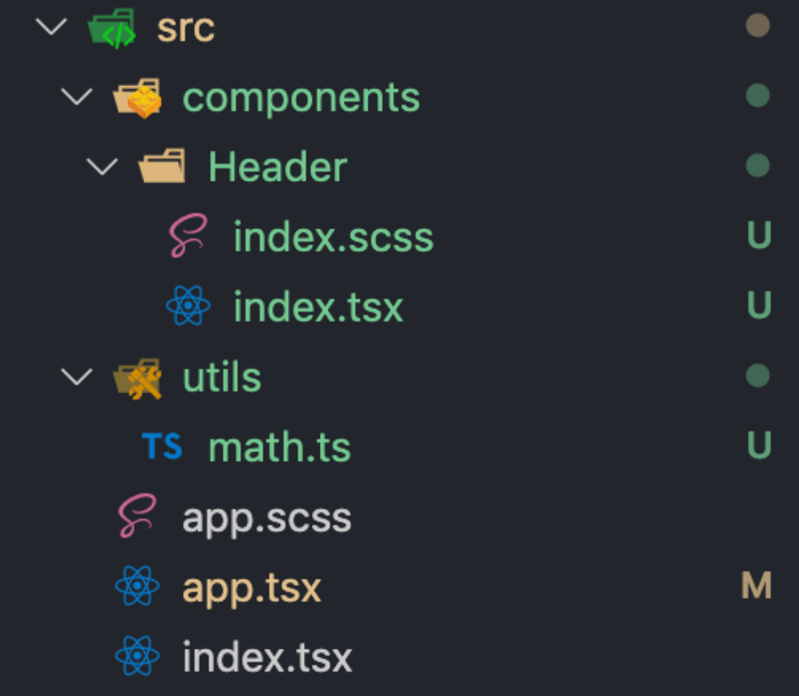

# React18 + ts5 + webpack5配置

# 一、支持react

终于来到我们 React 的支持环节了，美好的开始就是安装 `react` 和 `react-dom` ：

```
yarn add react@18.2.0 react-dom@18.2.0 -S
```

`-S` 相当于 `--save` ， `-D` 相当于 `--save-dev` 。

其实安装了这两个包就已经能使用 jsx 语法了，我们在 `src/index.js` 中输入以下代码：

```react
import React from 'react'
import ReactDOM from 'react-dom'
import App from './App'

ReactDOM.render(<App />, document.querySelector('#root'))
```

在 `src/app.js` 中输入以下示例代码：

```react
import React from 'react'

function App() {
  return <div className='App'>Hello World</div>
}

export default App
```

然后修改 `webpack.common.js` 中 `entry` 字段，修改入口文件为 `index.js` ：

```js
module.exports = {
  entry: {
    app: resolve(PROJECT_PATH, "./src/index.js"),
  },
};
```

# 二、禁止eslint-typescript插件检测js

```js
overrides: [
  // 不检测js文件的类型
  {
    extends: ['plugin:@typescript-eslint/disable-type-checked'],
    files: ['./**/*.js'],
  },
],
```

# 三、支持js，tsx

诶！为啥啊，我不是都安装了 react 了吗，咋还不行啊？
因为 webpack 根本识别不了 jsx 语法，那怎么办？使用 [babel-loader](https://github.com/babel/babel-loader) 对文件进行预处理。

**在此，强烈建议大家先阅读一篇关于 babel 写的很好的文章：**[**不容错过的 Babel7 知识**](https://juejin.im/post/5ddff3abe51d4502d56bd143)**，绝对的收获满满，我知道在自己文章中插入一个链接，让读者去阅读再回来接着读这种行为挺让人反感的，我看别人文章时也有这种感觉，但是在这里我真的不得不推荐，一定要读！一定要读！一定要读！**

好了，安装该有的包：

```
yarn add babel-loader@9.1.3 @babel/core@7.24.0 @babel/preset-react@7.23.3 -D
```

[babel-loader](https://github.com/babel/babel-loader) 使用 `babel` 解析文件；[@babel/core](https://babeljs.io/docs/en/next/babel-core.html) 是 `babel` 的核心模块；[@babel/preset-react ](https://babeljs.io/docs/en/next/babel-preset-react)转译 jsx 语法。

在根目录下新建 `.babelrc` 文件，输入以下代码：

```
{
  "presets": ["@babel/preset-react"]
}
```

[presets](https://babeljs.io/docs/en/presets) 是一些列插件集合。比如 `@babel/preset-react` 一般情况下会包含 `@babel/plugin-syntax-jsx` 、 `@babel/plugin-transform-react-jsx` 、 `@babel/plugin-transform-react-display-name` 这几个 babel 插件。

接下来打开我们的 `webpack.common.js` 文件，增加以下代码：

```js
module.exports = {
	// other...
  module: {
    rules: [
      {
        test: /\.(tsx?|js)$/,
        loader: 'babel-loader',
        options: { cacheDirectory: true },
        exclude: /node_modules/,
      },
      // other...
    ]
  },
  plugins: [ //... ],
}
```

注意，我们匹配的文件后缀只有 `.tsx` 、`.ts` 、 `.js` ，我把 `.jsx` 的格式排除在外了，因为我不可能在 ts 环境下建 `.jsx` 文件，实在要用 jsx 语法的时候，用 `.js` 不香吗？

`babel-loader` 在执行的时候，可能会产生一些运行期间重复的公共文件，造成代码体积大冗余，同时也会减慢编译效率，所以我们开启 `cacheDirectory` 将这些公共文件缓存起来，下次编译就会加快很多。

建议给 `loader` 指定 `include` 或是 `exclude`，指定其中一个即可，因为 `node_modules` 目录不需要我们去编译，排除后，有效提升编译效率。

现在，我们可以 `npm run start` 看看效果了！其实 babel 还有一些其他重要的配置，我们先把 TS 支持了再一起搞！

# 四、支持 TypeScript

webpack 模块系统只能识别 js 文件及其语法，遇到 jsx 语法、tsx 语法、文件、图片、字体等就需要相应的 loader 对其进行预处理，像图片、字体这种我们上面已经配置了，为了支持 React，我们使用了 `babel-loader` 以及对应的插件，现在如果要支持 TypeScript 我们也需要对应的插件。

## 1.安装对应 babel 插件

[@babel/preset-typescript](https://babeljs.io/docs/en/babel-preset-typescript) 是 babel 的一个 preset，它编译 ts 的过程很粗暴，它直接去掉 ts 的类型声明，然后再用其他 babel 插件进行编译，所以它很快。

废话补多少，先来安装它：

```
yarn add @babel/preset-typescript@7.23.3 -D
```

注意：我们之前因为 Eslint 的配置地方需要先安装 Typescript，所以之前安装过的就不用再安装一次了。

然后修改 `.babelrc` ：

```
{
  "presets": ["@babel/preset-react", "@babel/preset-typescript"]
}
```

[presets 的执行顺序](https://babeljs.io/docs/en/presets#preset-ordering)是从后到前的。根据以上代码的 babel 配置，会先执行 `@babel/preset-typescript` ，然后再执行 `@babel/preset-react` 。

## 2.tsx 语法测试

`src/` 有以下两个 `.tsx` 文件，代码分别如下：

`index.tsx` ：

```react
import React from 'react'
import ReactDOM from 'react-dom'
import App from './app'

ReactDOM.render(
  <App name='vortesnail' age={25} />,
  document.querySelector('#root')
)
```

`app.tsx` ：

```react
import React from 'react'

interface IProps {
  name: string
  age: number
}

function App(props: IProps) {
  const { name, age } = props
  return (
    <div className='app'>
      <span>{`Hello! I'm ${name}, ${age} years old.`}</span>
    </div>
  )
}

export default App
```

很简单的代码，在 `<App />` 中输入属性时因为 ts 有了良好的智能提示，比如你不输入 `name` 和 `age` ，那么就会报错，因为在 `<App />` 组件中，这两个属性时必须值！

但是这个时候如果你 `npm run start` ，发现是编译有错误的，我们修改 `webpack.common.js` 文件：

```js
module.exports = {
  entry: {
    app: resolve(PROJECT_PATH, './src/index.tsx'),
  },
  output: {//...},
  resolve: {
    extensions: ['.tsx', '.ts', '.js', '.json'],
  },
}
```

一来修改了 `entry` 中的入口文件后缀，变为 `.tsx` 。

二来新增了 `resolve` 属性，在 [extensions](https://webpack.js.org/configuration/resolve/#resolveextensions) 中定义好文件后缀名后，在 import 某个文件的时候，比如上面代码：

```
import App from './app'
```

就可以不加文件后缀名了。webpack 会按照定义的后缀名的顺序依次处理文件，比如上文配置 `['.tsx', '.ts', '.js', '.json']` ，webpack 会先尝试加上 `.tsx` 后缀，看找得到文件不，如果找不到就依次尝试进行查找，所以我们在配置时尽量把最常用到的后缀放到最前面，可以缩短查找时间。

这个时候再进行 `npm run start` ，页面就能正确输出了。

## 3.增加react类型声明

既然都用上了 Typescript，那 React 的类型声明自然不能少，安装它们：

```
yarn add @types/react@18.2.66 @types/react-dom@18.2.22 -D
```

## 4.tsconfig.json 详解

每个 Typescript 都会有一个 `tsconfig.json` 文件，其作用简单来说就是：

- 编译指定的文件
- 定义了编译选项

一般都会把 `tsconfig.json` 文件放在项目根目录下。在控制台输入以下代码来生成此文件：

```
npx tsc --init
```

打开生成的 `tsconfig.json` ，有很多注释和几个配置，有点点乱，我们就将这个文件的内容删掉吧，重新输入我们自己的配置。

此文件中现在的代码为：

```json
{
  "compilerOptions": {
    // 基本配置
    "target": "ES5", // 编译成哪个版本的 es
    "module": "ESNext", // 指定生成哪个模块系统代码
    "lib": ["dom", "dom.iterable", "esnext"], // 编译过程中需要引入的库文件的列表
    "allowJs": true, // 允许编译 js 文件
    "jsx": "react", // 在 .tsx 文件里支持 JSX
    "isolatedModules": true,
    "strict": true, // 启用所有严格类型检查选项

    // 模块解析选项
    "moduleResolution": "node", // 指定模块解析策略
    "esModuleInterop": true, // 支持 CommonJS 和 ES 模块之间的互操作性
    "resolveJsonModule": true, // 支持导入 json 模块
    "baseUrl": "./", // 根路径
    "paths": {
      // 路径映射，与 baseUrl 关联
      "Src/*": ["src/*"],
      "Components/*": ["src/components/*"],
      "Utils/*": ["src/utils/*"]
    },

    // 实验性选项
    "experimentalDecorators": true, // 启用实验性的ES装饰器
    "emitDecoratorMetadata": true, // 给源码里的装饰器声明加上设计类型元数据

    // 其他选项
    "forceConsistentCasingInFileNames": true, // 禁止对同一个文件的不一致的引用
    "skipLibCheck": true, // 忽略所有的声明文件（ *.d.ts）的类型检查
    "allowSyntheticDefaultImports": true, // 允许从没有设置默认导出的模块中默认导入
    "noEmit": true // 只想使用tsc的类型检查作为函数时（当其他工具（例如Babel实际编译）时）使用它
  },
  "exclude": ["node_modules"]
}
```

`compilerOptions` 用来配置编译选项，其完整的可配置的字段从[这里](https://www.tslang.cn/docs/handbook/compiler-options.html)可查询到； `exclude` 指定了不需要编译的文件，我们这里是只要是 `node_modules` 下面的我们都不进行编译，当然，你也可以使用 `include` 去指定需要编译的文件，两个用一个就行。

接下来对 `compilerOptions` 重要配置做一下简单的解释：

- `target` 和 `module` ：这两个参数实际上没有用，它是通过 `tsc` 命令执行才能生成对应的 es5 版本的 js 语法，但是实际上我们已经使用 babel 去编译我们的 ts 语法了，根本不会使用 `tsc` 命令，所以它们在此的作用就是让编辑器提供错误提示。
- `isolatedModules` ：可以提供额外的一些语法检查。

比如不能重复 `export` ：

```ts
import { add } from "./utils";
add();

export { add }; // 会报错
```

比如每个文件必须是作为独立的模块：

```ts
const print = (str: string) => { console.log(str) } // 会报错，没有模块导出

// 必须有 export
export print = (str: string) => {
  console.log(str)
}
```

- `esModuleInterop` ：允许我们导入符合 es6 模块规范的 CommonJS 模块，下面做简单说明。

比如某个包为 `test.js` ：

```ts
// node_modules/test/index.js
exports = test;
```

使用此包：

```ts
// 我们项目中的 app.tsx
import * as test from "test";
test();
```

开启 `esModuleInterop` 后，直接可如下使用：

```js
import test from "test";
test();
```

## 5.baseUrl&paths&配置别名



我在 `app.js` 中要引入 `src/components` 下的 `Header` 组件，以往的方式是：

```
import Header from './components/Header'
```

大家可能觉得，蛮好的啊，没毛病。但是我这里是因为 `app.tsx` 和 `components` 是同级的，试想一下如果你在某个层级很深的文件里要用 `components` ，那就是疯狂 `../../../..` 了，所以我们要学会使用它，并结合 webpack 的 `resolve.alias` 使用更香。

但是想用它麻烦还蛮多的，咱一步步拆解它。

首先 `baseUrl` 一定要设置正确，我们的 `tsconfig.json` 是放在项目根目录的，那么 `baseUrl` 设为 `./` 就代表了项目根路径。于是， `paths` 中的每一项路径映射，比如 `["src/*"]` 其实就是相对根路径。

如果大家像上面一样配置了，并自己尝试用以下方式开始进行模块的引入：

```
import Header from '@components/Header'
```

因为 eslint 的原因，是会报错的：


这个时候需要改 `.eslintrc.js` 文件的配置了，首先得安装 [eslint-import-resolver-typescript](https://github.com/alexgorbatchev/eslint-import-resolver-typescript) ：

```
yarn add eslint-import-resolver-typescript@3.6.1 -D
```

然后在 `.eslintrc.js` 文件的 `setting` 字段修改为以下代码：

```
settings: {
  'import/resolver': {
    node: {
      extensions: ['.tsx', '.ts', '.js', '.json'],
    },
    typescript: {},
  },
},
```

是的，只需要添加 `typescript: {}` 即可，这时候再去看已经没有报错了。并且是index的文件可以直接不用写，只需要到header层就行了。
但是上面我们完成的工作仅仅是对于编辑器来说可识别这个路径映射，我们需要在 `webpack.common.js` 中的 `resolve.alias` 添加相同的映射规则配置：


现在，两者一致就可以正常开发和打包了！可能有的小伙伴会疑惑，我只配置 webpack 中的 alias 不就行了吗？虽然开发时会有报红，但并不会影响到代码的正确，毕竟打包或开发时 webpack 都会进行路径映射替换。是的，的确是这样，但是在 `tsconfig.json` 中配置，会给我们增加智能提示，比如我打字打到 `@com` ，编辑器就会给我们提示正确的 `@components` ，而且其下面的文件还会继续提示。

# 五、配置es6+转es5

之前我们已经使用 babel 去解析 react 语法和 typescript 语法了，但是目前我们所做的也仅仅如此，你在代码中用到的 ES6+ 语法编译之后依然全部保留，然而不是所有浏览器都能支持 ES6+ 语法的，这时候就需要[@babel/preset-env](https://babeljs.io/docs/en/next/babel-preset-env.html) 来做这个苦力活了，它会根据设置的目标浏览器环境（browserslist）找出所需的插件去转译 ES6+ 语法。比如 `const` 或 `let` 转译为 `var` 。

但是遇到 `Promise` 或 `.includes` 这种新的 es 特性，是没办法转译到 es5 的，除非我们把这中新的语言特性的实现注入到打包后的文件中，不就行了吗？我们借助 [@babel/plugin-transform-runtime](https://www.babeljs.cn/docs/babel-plugin-transform-runtime) 这个插件，它和 `@babel/preset-env` 一样都能提供 ES 新API 的垫片，都可实现按需加载，但前者不会污染原型链。

另外，babel 在编译每一个模块的时候在需要的时候会插入一些辅助函数例如 `_extend` ，每一个需要的模块都会生成这个辅助函数，显而易见这会增加代码的冗余，[@babel/plugin-transform-runtime](https://www.babeljs.cn/docs/babel-plugin-transform-runtime) 这个插件会将所有的辅助函数都从 `@babel/runtime-corejs3` 导入（我们下面使用 corejs3），从而减少冗余性。

```
yarn add  @babel/preset-env@7.24.0 @babel/plugin-transform-runtime@7.24.0 -D

yarn add @babel/runtime-corejs3@7.24.0 -S
```

> 注意： `@babel/runtime-corejs3` 的安装为生产依赖。

修改 `.babelre` 如下：

```json
{
  "presets": [
    [
      "@babel/preset-env",
      {
        // 防止babel将任何模块类型都转译成CommonJS类型，导致tree-shaking失效问题
        "modules": false
      }
    ],
    "@babel/preset-react",
    "@babel/preset-typescript"
  ],
  "plugins": [
    [
      "@babel/plugin-transform-runtime",
      {
        "corejs": {
          "version": 3,
          "proposals": true
        },
        "useESModules": true
      }
    ]
  ]
}
```

**到此为止，我们的 react+typescript 项目开发环境已经可行了，就是说现在已经可以正常进行开发了，但是针对开发环境和生产环境，我们能做的优化还有很多，大家继续加油！**
